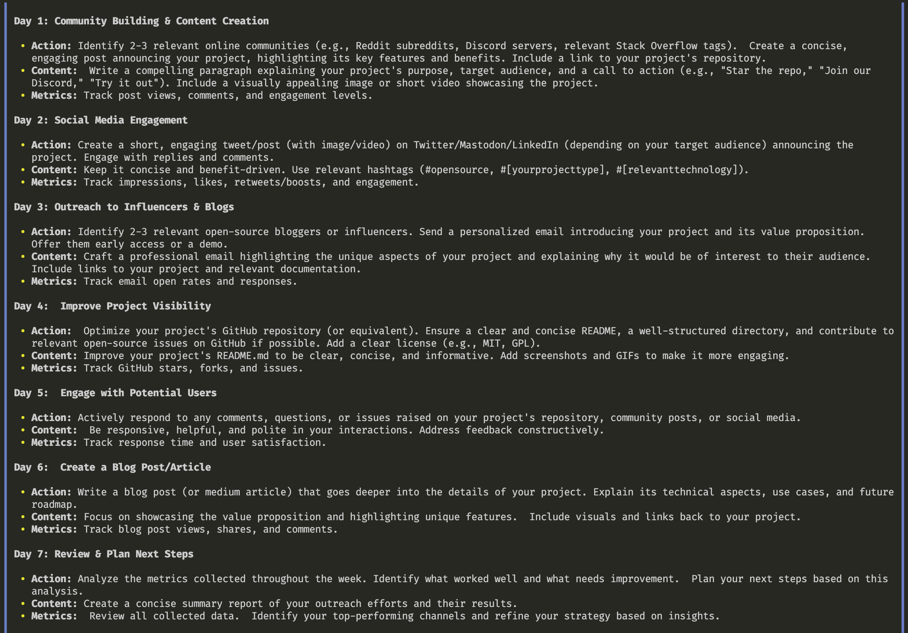
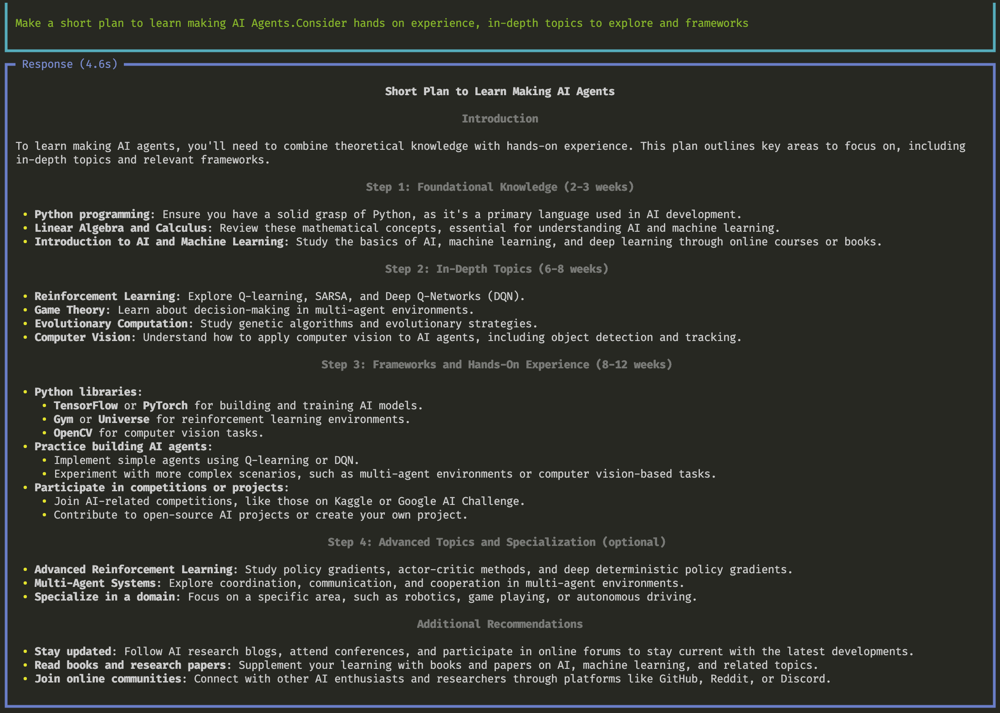

# News Sharing AI Agent

Welcome to the News Sharing AI Agent project! This project aims to develop an AI agent that can curate and share news articles of the given date.

## Features

- **Search Internet**: AI Agent and search the internet to find news
- **Uses State of the Art Phidata**: AI Agent is based on `phidata` - easy to understand and update
- **Share Anywhere**: News fetching and sharing are separate tasks so could be performed modularly
- **Coder-Friendly Interface**: Easy to use and navigate.

## Installation

To install and set up the project, follow these steps:

1. Clone the repository:
  ```bash
  git clone https://github.com/ashgkwd/news-sharing-ai-agent.git
  ```
2. Navigate to the project directory:
  ```bash
  cd news-sharing-ai-agent
  ```
3. Install the required dependencies:
  ```bash
  pip install -r requirements.txt
  ```
4. Put relevant ENVs in the .env file. Create a .env file if it does not exist
  ```bash
  GROQ_API_KEY=yourkeyhere
  GOOGLE_API_KEY=yourkeyhere
  ```

## Usage

To start the AI agent, run the following command:
```bash
python example_gemini.py
```

You can see output of the agent in your terminal. Here is how it should look:



You can also try out Groq model instead of Gemini.
```bash
python example_groq.py
```

It should output on your terminal. Here is how it should look:



## Contributing

We welcome contributions! Please fork and create a PR back to this project and tag me in comments for review.

## License

This project is licensed under the MIT License. See the [LICENSE](LICENSE) file for more information.

## Contact

If you have any questions or suggestions, feel free to open an issue or contact me.

Happy news sharing!
